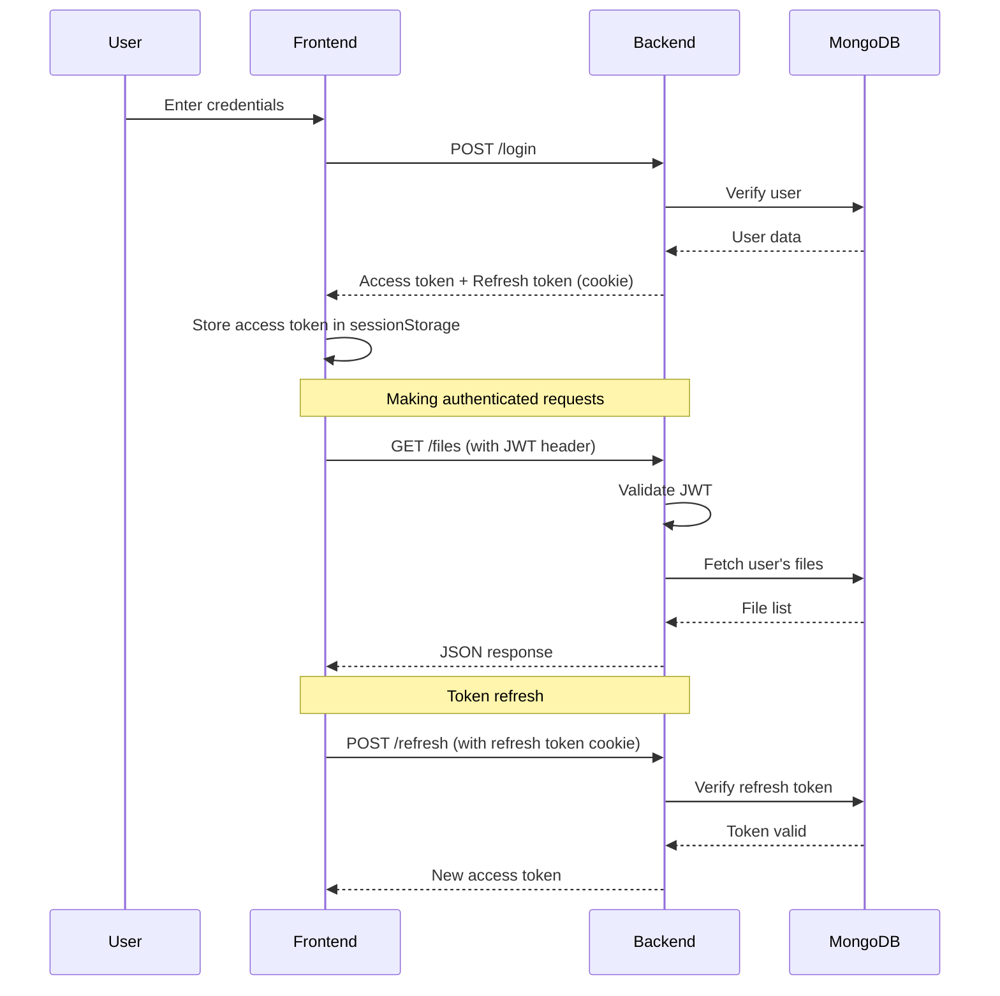

# Cloud File Storage System

A full-stack cloud file storage application with secure JWT authentication, built with Spring Boot and Vue.js 3.


## 📖 Overview

A modern, secure file storage system that allows users to upload, manage, and share files with a beautiful, responsive interface. Features include JWT authentication, real-time upload progress, media previews, and dark/light themes.

## ✨ Key Features

### 🔐 Security
- **JWT Authentication** with refresh tokens
- **BCrypt password hashing**
- **File ownership verification**
- **Path traversal protection**
- **CORS restrictions**
- **httpOnly cookies** for refresh tokens

### 📁 File Management
- Upload files up to 3GB
- Download files
- Preview images, videos, audio, PDFs, and text files
- Delete files with confirmation
- View storage usage
- User-specific file isolation

### 🎨 User Experience
- **Responsive design** (mobile, tablet, desktop)
- **Dark/Light theme** toggle
- **Real-time upload progress** bar
- **Themed modal dialogs**
- **Smooth animations**
- **Intuitive navigation**

### 🚀 Performance
- **Blob URL caching** for media
- **Lazy loading** of routes
- **Code splitting**
- **Memory leak prevention**
- **Optimized builds**

## 🏗️ Architecture

```
┌─────────────────┐         HTTP/REST         ┌─────────────────┐
│                 │ ◄────────────────────────► │                 │
│   Vue.js 3      │    JWT Authentication      │  Spring Boot    │
│   Frontend      │                            │    Backend      │
│   (Port 5173)   │                            │   (Port 8080)   │
│                 │                            │                 │
└─────────────────┘                            └────────┬────────┘
                                                        │
                                                        │
                                                        ▼
                                                ┌───────────────┐
                                                │   MongoDB     │
                                                │  (Port 27017) │
                                                └───────────────┘
```

## 🛠️ Tech Stack

### Backend
- **Java 17**
- **Spring Boot 3.1.5**
- **Spring Security** - Authentication & Authorization
- **Spring Data MongoDB** - Database operations
- **JJWT 0.11.5** - JWT tokens
- **Maven** - Build tool

### Frontend
- **Vue.js 3** - Progressive framework
- **Vite** - Build tool
- **Vue Router** - Routing
- **Pinia** - State management
- **Axios** - HTTP client
- **Lucide Vue Next** - Icons

### Database
- **MongoDB 4.4+** - NoSQL database

## 📋 Prerequisites

- **Java 17** or higher
- **Maven 3.6+**
- **Node.js 16+** and **npm 8+**
- **MongoDB 4.4+**

## 🚀 Quick Start

### 1. Clone the Repository
```bash
git clone <repository-url>
cd APP
```

### 2. Start MongoDB
```bash
# Using Docker
docker run -d -p 27017:27017 --name mongodb mongo:latest

# Or use local MongoDB
mongod
```

### 3. Configure Backend
Edit `backend/src/main/resources/application.properties`:
```properties
# IMPORTANT: Change this in production!
jwt.secret=YOUR_SECRET_KEY_HERE_MIN_256_BITS
```

### 4. Start Backend
```bash
cd backend
# Build and run
./mvnw clean install
./mvnw spring-boot:run
```

Backend will run on `http://localhost:8080`

### 5. Configure Frontend
Create `frontend/.env`:
```env
VITE_API_URL=http://localhost:8080
```

### 6. Start Frontend
```bash
cd frontend
npm install
npm run dev
```

Frontend will run on `http://localhost:5173`

### 7. Access the Application
Open your browser and navigate to `http://localhost:5173`

## 📚 API Integration

### Authentication Flow



### Request/Response Examples

#### Register
```bash
curl -X POST http://localhost:8080/register \
  -H "Content-Type: application/json" \
  -d '{"username":"john","password":"secret123"}'
```

**Response:**
```json
{
  "message": "User registered successfully"
}
```

#### Login
```bash
curl -X POST http://localhost:8080/login \
  -H "Content-Type: application/json" \
  -d '{"username":"john","password":"secret123"}' \
  -c cookies.txt
```

**Response:**
```json
{
  "accessToken": "eyJhbGciOiJIUzI1NiIsInR5cCI6IkpXVCJ9...",
  "username": "john",
  "message": "Login successful"
}
```

#### Upload File
```bash
curl -X POST http://localhost:8080/upload \
  -H "Authorization: Bearer YOUR_ACCESS_TOKEN" \
  -F "file=@document.pdf" \
  -b cookies.txt
```

#### List Files
```bash
curl -X GET http://localhost:8080/files \
  -H "Authorization: Bearer YOUR_ACCESS_TOKEN" \
  -b cookies.txt
```

**Response:**
```json
[
  {
    "id": "507f1f77bcf86cd799439011",
    "filename": "document.pdf",
    "contentType": "application/pdf",
    "size": 1048576,
    "uploadDate": "2024-01-15T10:30:00Z",
    "ownerId": "user123"
  }
]
```

## 🔄 Frontend-Backend Integration

### Axios Configuration

The frontend uses Axios interceptors for seamless JWT integration:

```javascript
// Request Interceptor - Add JWT to all requests
axios.interceptors.request.use(config => {
  const authStore = useAuthStore()
  if (authStore.accessToken) {
    config.headers.Authorization = `Bearer ${authStore.accessToken}`
  }
  return config
})

// Response Interceptor - Handle token refresh
axios.interceptors.response.use(
  response => response,
  async error => {
    if (error.response?.status === 401) {
      // Token expired, try to refresh
      const newToken = await authStore.refreshAccessToken()
      if (newToken) {
        // Retry original request with new token
        error.config.headers.Authorization = `Bearer ${newToken}`
        return axios(error.config)
      }
    }
    throw error
  }
)
```

### CORS Configuration

Backend allows requests from frontend origin:

```java
@Bean
public CorsConfigurationSource corsConfigurationSource() {
    CorsConfiguration configuration = new CorsConfiguration();
    configuration.setAllowedOrigins(Arrays.asList("http://localhost:5173"));
    configuration.setAllowedMethods(Arrays.asList("GET", "POST", "PUT", "DELETE", "OPTIONS"));
    configuration.setAllowedHeaders(Arrays.asList("*"));
    configuration.setAllowCredentials(true);
    
    UrlBasedCorsConfigurationSource source = new UrlBasedCorsConfigurationSource();
    source.registerCorsConfiguration("/**", configuration);
    return source;
}
```

## 📁 Project Structure

```
APP/
├── backend/                      # Backend (Spring Boot)
│   ├── src/
│   │   └── main/
│   │       ├── java/
│   │       │   └── com/example/filestorage/
│   │       │       ├── controller/   # REST controllers
│   │       │       ├── model/        # Entity models
│   │       │       ├── repository/   # MongoDB repositories
│   │       │       ├── security/     # Security configuration
│   │       │       ├── service/      # Business logic
│   │       │       └── exception/    # Error handling
│   │       └── resources/
│   │           └── application.properties
│   ├── uploads/                 # File storage directory
│   ├── pom.xml                  # Maven configuration
│   └── README.md                # Backend documentation
├── frontend/                    # Frontend (Vue.js)
│   ├── src/
│   │   ├── components/          # Reusable components
│   │   ├── views/               # Page components
│   │   ├── stores/              # Pinia stores
│   │   ├── router/              # Vue Router
│   │   └── config/              # Configuration
│   ├── .env                     # Environment variables
│   ├── vite.config.js           # Vite configuration
│   └── README.md                # Frontend documentation
└── README.md                    # This file (Main documentation)
```

## 🔐 Security Best Practices

### Production Checklist

- [ ] Change `jwt.secret` to a strong, random value (min 256 bits)
- [ ] Use environment variables for sensitive data
- [ ] Enable HTTPS/TLS
- [ ] Update CORS to production frontend URL
- [ ] Set secure cookie flags (`Secure`, `SameSite`)
- [ ] Implement rate limiting
- [ ] Enable MongoDB authentication
- [ ] Use strong MongoDB passwords
- [ ] Implement file type validation
- [ ] Add virus scanning for uploads
- [ ] Set up logging and monitoring
- [ ] Regular security audits

### Environment Variables

#### Backend
```bash
export SPRING_DATA_MONGODB_URI=mongodb://prod-server:27017/filestorage
export JWT_SECRET=your-production-secret-key-min-256-bits
export SERVER_PORT=8080
```

#### Frontend
```bash
export VITE_API_URL=https://api.yourapp.com
```

## 🚀 Deployment

### Backend (Spring Boot)

#### JAR Deployment
```bash
cd backend
./mvnw clean package -DskipTests
java -jar target/filestorage-0.0.1-SNAPSHOT.jar
```

#### Docker
```dockerfile
FROM openjdk:17-jdk-slim
WORKDIR /app
COPY target/*.jar app.jar
EXPOSE 8080
ENTRYPOINT ["java", "-jar", "app.jar"]
```

### Frontend (Vue.js)

#### Build
```bash
cd frontend
npm run build
```

#### Deploy to Vercel
```bash
vercel --prod
```

#### Deploy to Netlify
```bash
netlify deploy --prod --dir=dist
```

## 📊 Database Schema

### Collections

#### users
```json
{
  "_id": "ObjectId",
  "username": "string",
  "password": "string (bcrypt)",
  "roles": ["USER"]
}
```

#### fileMetadata
```json
{
  "_id": "ObjectId",
  "filename": "string",
  "contentType": "string",
  "size": "number",
  "uploadDate": "date",
  "ownerId": "string"
}
```

#### refreshTokens
```json
{
  "_id": "ObjectId",
  "token": "string (JWT)",
  "username": "string",
  "expiryDate": "instant",
  "createdDate": "instant"
}
```

## 🧪 Testing

### Backend Tests
```bash
cd backend
./mvnw test
```

### Frontend Tests
```bash
cd frontend
npm run test
```

## 🐛 Troubleshooting

### Common Issues

**1. CORS Errors**
- Ensure backend `SecurityConfig` allows frontend origin
- Check that `withCredentials: true` is set in Axios

**2. 401 Unauthorized**
- Verify JWT token is being sent in Authorization header
- Check if token has expired
- Try logging out and logging back in

**3. File Upload Fails**
- Check file size limits in both frontend and backend
- Verify `uploads/` directory exists and is writable
- Check MongoDB connection

**4. MongoDB Connection Failed**
- Ensure MongoDB is running
- Verify connection string in `application.properties`
- Check MongoDB port (default: 27017)

## 📝 API Documentation

For detailed API documentation, see:
- [Backend README](backend/README.md)
- [Frontend README](frontend/README.md)

## 🤝 Contributing

Contributions, issues, and feature requests are welcome!

## 👨‍💻 Author

**Sreenath**

---

**Happy Coding! 🚀**
